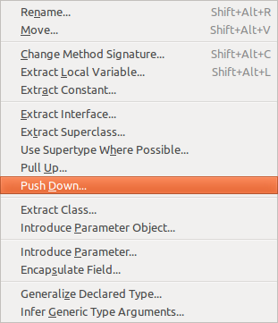
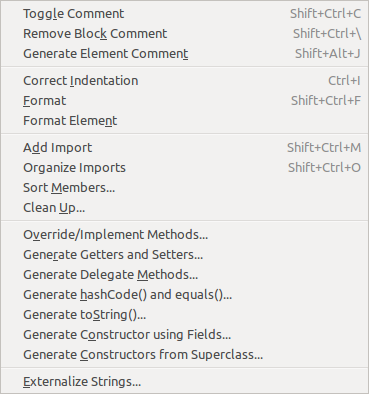

class: center, middle

# Eclipse for ninjas

Thou shalt know the tools.

---

# Eclipse as an editor

- it's slow
- it's heavy
- it's written in java

--

The problem is...

---
class: center, middle

# ECLIPSE IS *NOT* AN EDITOR

--

Eclipse is a nuclear power plant that also happens to help you coding in any JVM language (and more)

---

## Did you know... Auto-complete?

You can auto complete almost everyting just by writing a bunch of characters and/or pressing `Ctrl-space`

.center[]

--

Of course you know, but if you didn't: i have bad news for ya...

---
## Auto-complete

It has **fuzzy search**, thanks to Code recommenders' plugin.

I.e. if you have long methods' names with almost the same prefix:

- `setTheEndOfTheWorldAsYouKnowItById`
- `setTheEndOfTheWorldAsYouKnowItByName`
- ...

you don't need to type  `setTheEndOfTheW...` and so on to get the right, just type some characters like `swid`, press the magic shortcut, and BAM, close the issue and go home.

???

It works also on selected preferences dialogs.

---
## Did you know... Contextual fix?

Eclipse is smart enough to suggest _and do_ repair your code if you kindly ask it to.

.center[
  
]

No more catching the tooltip mouse clicking... just press `Ctrl-1` and off to the next bug...

---
## Did you know... Quick assist?

Shortcut: `Ctrl-2 (wait) {F,L,M,R}`

This shortcut can do a lot of things:

- assign an object to a variable
- assign an object to a field
- extract a method from selected lines
- rename a piece of code (variable, field, method, class, ...)

Some of these are so common they have their own shortcut, but this shortcut shows a tooltip suggesting the next button you should tap ;)

---
## Alternative shortcuts for quick assist

- You can rename by using `Alt-Shift-R`.
- You can assign an object to a variable with `Alt-Shift-L`
- You can extract a method from selected lines with `Alt-Shift-M`
- There's a way to promote a variable to a field via the refactor menu, see next slides...

---
## Did you know... Quick navigation?

Press `Ctrl-3`, type the name of dialogs, files, perspectives, etc.. and BAM, you reach it!

.center[
]

---
## Did you know... tests?

You hate tests, right?

--

No you don't, because you are a very good person.

Here's a way to create a test method:

You type `test`, press `Ctrl-space`, `Enter`, type the name of the test, and code it.

???

Because it should not be hard to write a test: eclipse knows it, and happily helps you.

---
class: center, middle

*CAN YOU SEE IT NOW???*

---
## Did you know... _running_ tests?

So you have test and a happy mouse to click `Run`.

--

No, you don't: you press `Alt-shift-X T` because you're faster than light.

Eclipse is also smart enough to run either the full test class, in general, or the single test if you select the current method name.

---
## Did you know... _debugging_ and running other things?

There are shortcuts to:

- debug tests: `Alt-shift-D T`
- run main methods: `Alt-shift-X J`
- debug main methods: `Alt-shift-D J`

--

Do you really (tm) need a main method or is it just an excuse for not writing a test?

--

But the real deal is launching test coverage with `Alt-shift-E T` directly from the tests.

---
## Did you know... opening things?

You can open files from everywhere:

- Types using `Ctrl-shift-T`
- Generic files using `Ctrl-shift-R`

These dialogs let you type parts of the file/path/package and open it in edit mode.

They do not support fuzzy search (yet), but accept `*` wildcards.

---
## Did you know... refactor and source menus?

.left-column[
Refactor `Alt-shift-R`

]

--

.right-column[
Source `Alt-shift-S`

]

---
class: center, middle

Of course you don't need half of source menu, because you have immutable beans and use libraries such as [immutables](https://immutables.github.io/), right?

---
## Did you know... code navigation?

If you are on a new codebase:

- navigate to declaration/implementation of a method via `F3`
- find the type hierarchy of a class via `F4`
- list/navigate to methods using `Ctrl-O`
- search-as-you-type in the file via `Ctrl-J`
- go to line with `Ctrl-L`
- go to previously edited line/file with `Alt-left` or `Alt-right`
- go to method calls of a method: `Ctrl-alt-H`
- find occurrences of a string with `Ctrl-alt-G`

---
class:center, middle
# And also...the mighty...

DELETE LINES

with `Ctrl-D`

--

Which in IntelliJ IDEA is of course "duplicate lines".

---
class:center, middle
# Useful plugins

---
# Useful plugins: code recommenders

This is default from Eclipse Mars onwards:

It provides:

- fuzzy method name search in auto complete mode.
  E.g.: type `var` to get `getVar` and `setVar` suggested
- most frequently used method suggestion
- automatic code snippet suggestion (if enabled)

---
# Useful plugins: EGit

Again default from Eclipse Mars.

Provides git support in Eclipse.

--

It supports git flow branching model!

---
#Useful plugins: JBoss studio

Recommended for Java EE development in general, not limited to RedHat application server.

It provides:

- server integration within IDE
- CDI support
  + bean.xml parsing and modeling
  + producers discovery
  + scoped bean avoid
- JaxRs support and code validation
- Arquillian support

---
class: center, middle

# Dialogs you may have never heard about

---
# Dialogs: Tasks

It mantains a list of TODOs and other configurable markers all in one place.

Never miss a TODO again.

--

Please put date & name in your TODOs

---
# Dialogs: Display

This dialog is active in debuggings session.

It is a scratchpad that works within the current debug context.

You can:
- write some code & run it in the current context
- reference context's variables
- force a return of the current method with `Alt-Shift-F`

---
class: center, middle

# Miscellaneous

---
# Miscellaneous: Favorite classes

You can put your most favorite classes in this preference part: Eclipse will cache their methods and you can reference them without importing them before.

--

E.g.: if you use EasyMock often, you can add `org.easymock.EasyMock` to the preferences, and now you just need to type `createMock`: Eclipse will statically import the EasyMock method and you just need to `Ctrl-space` your way in the test.

--

Pro tip: use it for java 8 `Collectors` class, for assertj's `Assertions`, and for `EasyMock` for maximum productivity boost.

---
# Miscellaneous: Templates

You can create context-sensitive snippets and have the IDE type them for you.

--

E.g.

- Find yourself writing the TODOs in a particular way? Save it as a template!
- All your classes have a special method you always write? Another template!
- All your logs have the method name as first part? Template!!!

--

You'll wish to just `Ctrl-space` your life....

---

class: center, middle

# Questions

---

# Links

- EGit <a href="https://wiki.eclipse.org/EGit/User_Guide%23Enabling_Gitflow_for_a_repository">git flow</a>
- Eclipse [official wiki](https://wiki.eclipse.org)
- [JBoss tools](https://tools.jboss.org/features/)
- Not-so-jug [eclipse wiki](https://github.com/notsojug/jug-material/wiki/Eclipse)
